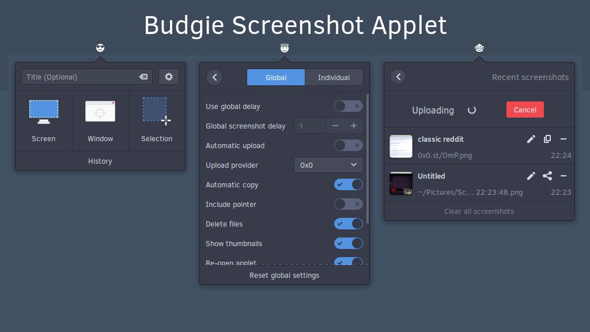

# Budgie Screenshot Widget
Take a screenshot of your desktop, a window or region; save to disk and upload. Made with ❤ for Budgie Desktop.

# Notice
This project is effectively in an indefinite hiatus.
This does not mean it's completely abandoned but do not expect any updates any time soon.

---

Buy me a beer/a coffee/love?  
[](https://paypal.me/StefanRic)



---

## Dependencies
```
budgie-1.0 >= 2
gnome-desktop-3.0
gtk+-3.0 >= 3.18
json-glib-1.0
libsoup-2.4
vala
```

These can be installed on Solus by running:  
```bash
sudo eopkg it budgie-desktop-devel libgnome-desktop-devel libjson-glib-devel libsoup-devel vala
```

### Installing

**From source**  
```bash
mkdir build && cd build
meson --prefix /usr --buildtype=plain ..
ninja
sudo ninja install
```

**Solus**  
You can install budgie-screenshot-applet from the Software Centre or via the command line:
```bash
sudo eopkg it budgie-screenshot-applet
```

**Arch Linux**  
You can install the [budgie-screenshot-applet](https://aur.archlinux.org/packages/budgie-screenshot-applet) package from the AUR
